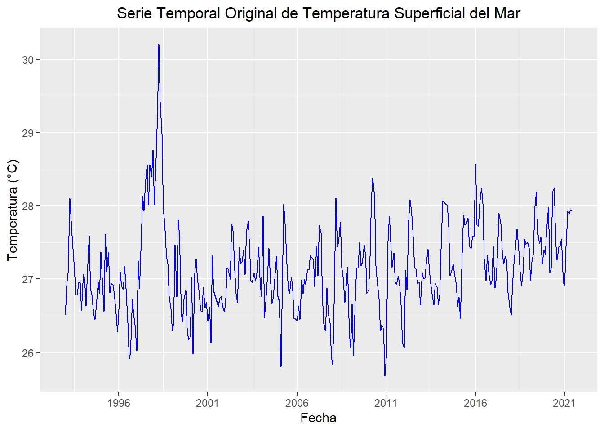
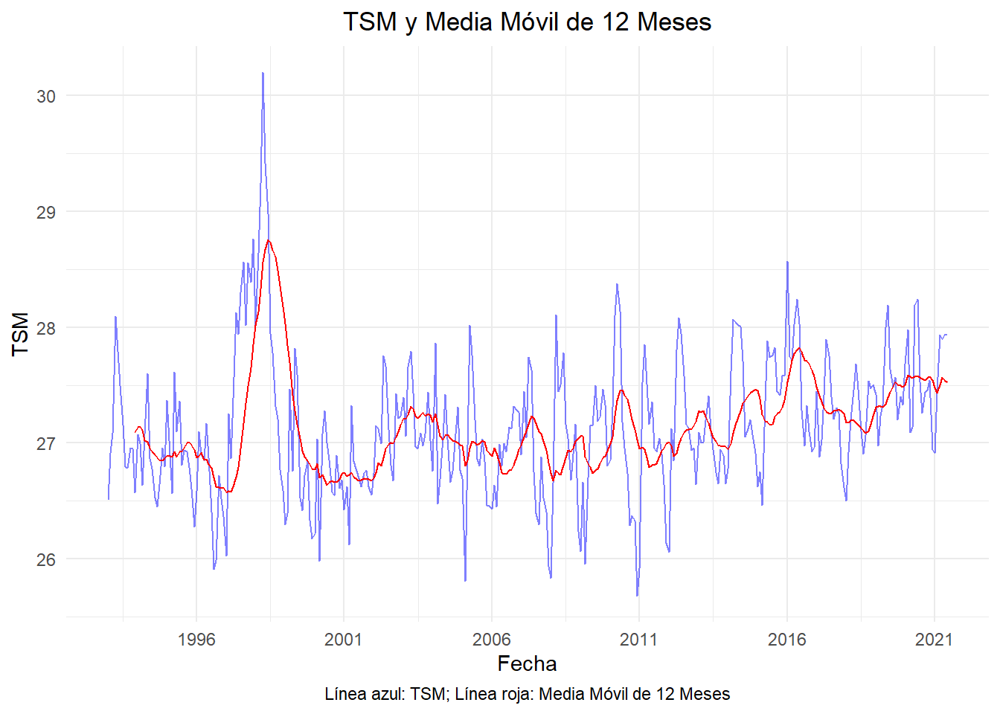
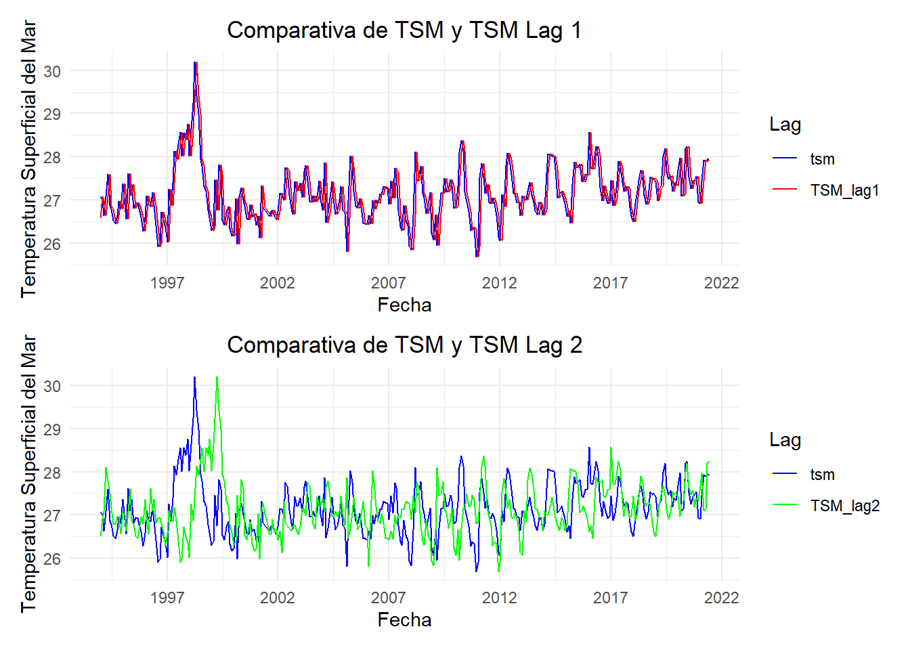
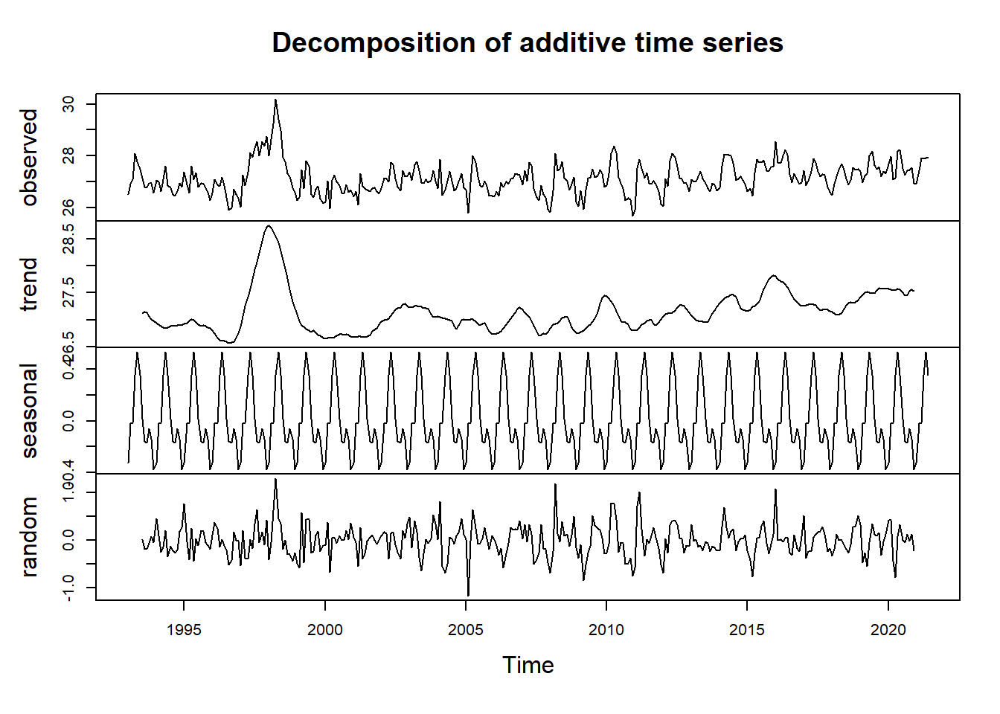
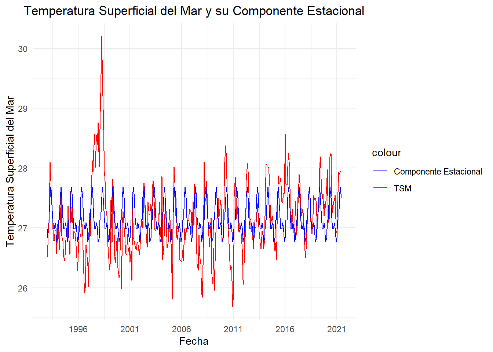

# Exploración de la Serie de Tiempo

La fase inicial de la exploración de los datos consiste en realizar una gratificación de la serie temporal con el fin de visualizar el comportamiento original de las observaciones en el tiempo. Esta representación gráfica permite identificar patrones preliminares, tendencias, estacionalidades y posibles anomalías en los datos, lo cual es fundamental para orientar el análisis posterior y definir las metodologías más adecuadas para el procesamiento y modelado de la serie. En este caso se gráfica la serie mensual de temperatura superficial del mar en el punto de interés especificado en el anterior apartado.

```{r setup, include = FALSE}
# Configuración general de los chunks
knitr::opts_chunk$set(
  warning = FALSE,  
  echo = TRUE,      
  comment = NA      
)
```

<details>
<summary>Mostrar código</summary>
```{r explorar1, eval=FALSE}
suppressPackageStartupMessages({
library(ncdf4)
library(tidyverse)
library(dplyr)
library(lubridate)
library(ggplot2)

})
archivo_nc <- nc_open ("C:/Users/lvasquez/OneDrive - PUJ Cali/2024_2/Series_de_tiempo/Unidad_1/Act_Bookdown/Series_tiempo_bookdown/Datos/cmems_mod_glo_phy_my_0.083deg_P1M-m_1729290245365.nc")

# Extracción de variables de interés
tsm <- ncvar_get(archivo_nc, "thetao")
tiempo <- ncvar_get(archivo_nc, "time")
latitud <- ncvar_get(archivo_nc, "latitude")
longitud <- ncvar_get(archivo_nc, "longitude")

# Creacion de dataframe 
df_tsm <- data.frame(
  tiempo = as.POSIXct(tiempo, origin = "1970-01-01", tz = "UTC"),
  latitud = rep(latitud, each = length(longitud)),
  longitud = rep(longitud, length(latitud)),
  tsm = as.vector(tsm)
)

# Grafica exploratoria inicial
df_tsm$Date <- as.Date(df_tsm$tiempo, origin = "1970-01-01")

# Graficar
ggplot(df_tsm, aes(x = Date, y = tsm)) +
  geom_line(color = "blue") +
  labs(title = "Serie Temporal Original de Temperatura Superficial del Mar", 
       x = "Fecha", y = "Temperatura (°C)") +
  scale_x_date(date_breaks = "5 years", date_labels = "%Y") +
  theme(plot.title = element_text(hjust = 0.5))
```
</details>



El promedio móvil, el rezago y la estacionalidad son técnicas fundamentales en el análisis de series temporales, utilizadas para identificar y entender los patrones subyacentes en los datos. El promedio móvil se aplica para suavizar las fluctuaciones a corto plazo, proporcionando una visión más clara de las tendencias a largo plazo al promediar valores consecutivos. El rezago, por su parte, implica desplazar la serie en el tiempo para analizar cómo los valores pasados influyen en los presentes, lo cual es esencial para modelar la autocorrelación y predecir futuros comportamientos. Finalmente, la estacionalidad se refiere a los patrones recurrentes en intervalos específicos (por ejemplo, mensual o anual), y su análisis permite identificar ciclos repetitivos que pueden ser cruciales para la toma de decisiones y el pronóstico de eventos futuros.


## Media movil anual

Para el análisis de la serie temporal de la temperatura superficial del mar (TSM), se aplica una media móvil anual con el objetivo de identificar tendencias a largo plazo. La TSM está sujeta a variaciones estacionales y fluctuaciones de corto plazo debido a fenómenos climáticos como El Niño y La Niña. Aunque una media móvil trimestral podría capturar estas variaciones de manera efectiva, no proporcionaría una visión clara de las tendencias subyacentes que ocurren en periodos más largos. Al utilizar una media móvil anual, se logra suavizar las fluctuaciones estacionales, permitiendo destacar patrones y cambios que reflejan variaciones climáticas a largo plazo, facilitando así el análisis de anomalías y la identificación de tendencias significativas en la serie de tiempo.


<details>
<summary>Mostrar código</summary>
```{r mmovil1, eval=FALSE}

suppressPackageStartupMessages({
library(dplyr)
library(zoo)
})

# Calcular la media móvil de 12 meses
df_tsm$mov_avg_tsm <- rollmean(df_tsm$tsm, k = 12, fill = NA, align = "right")

# Filtrar el dataframe para mostrar solo los meses donde hay una media móvil
df_mov_avg <- df_tsm %>% filter(!is.na(mov_avg_tsm))

# Mostrar el dataframe resultante
#print(df_tsm)

# Crear un gráfico de la serie temporal y la media móvil
ggplot(df_tsm, aes(x = Date)) +
  geom_line(aes(y = tsm), color = "blue", alpha = 0.5) +
  geom_line(aes(y = mov_avg_tsm), color = "red") +
  labs(title = "TSM y Media Móvil de 12 Meses",
       x = "Fecha",
       y = "TSM",
       caption = "Línea azul: TSM; Línea roja: Media Móvil de 12 Meses") +
  scale_x_date(date_breaks = "5 years", date_labels = "%Y") +
  theme_minimal() +
  theme(plot.title = element_text(hjust = 0.5),
        plot.caption = element_text(hjust = 0.5))


```
</details>



A partir del análisis de la media móvil anual aplicada a la temperatura superficial del mar (TSM), se observa que esta técnica suaviza la variabilidad de la señal original, lo que permite identificar de manera más clara la tendencia creciente a lo largo del tiempo. En particular, se evidencia que la temperatura superficial del mar ha venido incrementándose de forma paulatina desde 1993 hasta la actualidad en este punto de interés.

## Rezago

<details>
<summary>Mostrar código</summary>
```{r lag1, eval=FALSE}

library(dplyr)
library(ggplot2)
library(tidyr)
library(patchwork)

# Crear columnas de rezagos en el dataframe
df_tsm <- df_tsm %>%
  mutate(TSM_lag1 = lag(tsm, n = 1),
         TSM_lag2 = lag(tsm, n = 12))
         

# Eliminar filas con valores NA 
df_lag <- na.omit(df_tsm)

# Convertir a formato largo
df_long <- df_lag %>%
  pivot_longer(cols = c(tsm, TSM_lag1, TSM_lag2), 
               names_to = "Lag", 
               values_to = "Value")

# Gráfico 1: TSM y TSM_lag1
plot1 <- ggplot(df_long %>% filter(Lag %in% c("tsm", "TSM_lag1")), aes(x = Date)) + 
  geom_line(aes(y = Value, color = Lag)) +
  labs(title = "Comparativa de TSM y TSM Lag 1",
       x = "Fecha",
       y = "Temperatura Superficial del Mar") +
  scale_color_manual(values = c("blue", "red")) +
  scale_x_date(date_breaks = "5 years", date_labels = "%Y") +
  theme_minimal() +
  theme(plot.title = element_text(hjust = 0.5))

# Gráfico 2: TSM y TSM_lag2
plot2 <- ggplot(df_long %>% filter(Lag %in% c("tsm", "TSM_lag2")), aes(x = Date)) +  
  geom_line(aes(y = Value, color = Lag)) +
  labs(title = "Comparativa de TSM y TSM Lag 2",
       x = "Fecha",
       y = "Temperatura Superficial del Mar") +
  scale_color_manual(values = c("blue", "green")) +
  scale_x_date(date_breaks = "5 years", date_labels = "%Y") +
  theme_minimal() +
  theme(plot.title = element_text(hjust = 0.5))

# Combinar los gráficos en un solo layout
combined_plot <- plot1 / plot2
combined_plot

```
</details>



### Gráfica 1: Comparativa de TSM y TSM Lag 1

La primera gráfica muestra una fuerte correlación entre la temperatura superficial del mar (TSM) y su rezago de un mes (TSM_lag1). La similitud en los patrones de ambas series sugiere una alta persistencia en las condiciones térmicas del océano a corto plazo. Esto indica que las variaciones de temperatura en un mes dado tienden a influir significativamente en el mes siguiente. Sin embargo, se observan ligeros desfases y variaciones en la amplitud de las fluctuaciones, lo que podría estar relacionado con procesos oceánicos a pequeña escala o eventos climáticos locales que introducen cierta variabilidad en la señal.

### Gráfica 2: Comparativa de TSM y TSM Lag 2

La segunda gráfica, que compara la TSM con su rezago de 12 meses (TSM_lag2), revela una correlación menos evidente pero aún discernible. La similitud en los patrones generales sugiere la existencia de una señal anual en la TSM, lo que confirma la influencia de factores estacionales como la radiación solar y los patrones de viento. Sin embargo, La mayor diferencia entre ambas líneas (Verde vs original) sugiere que los procesos que afectan la TSM pueden tener escalas de tiempo más largas que un mes, posiblemente relacionadas con fenómenos climáticos a gran escala (e.g., El Niño-Oscilación del Sur).

### Análisis Combinado:

En conjunto, ambas gráficas sugieren que la temperatura superficial del mar está influenciada por una combinación de procesos a diferentes escalas temporales. A corto plazo, la persistencia en las condiciones térmicas es alta, mientras que a largo plazo, la variabilidad interanual está asociada con fenómenos climáticos más complejos.

## Estacionalidad 

<details>
<summary>Mostrar código</summary>
```{r estacionalidad1, eval=FALSE}

# Convertir la columna TSM a un objeto de serie temporal
tsm_ts <- ts(df_tsm$tsm, start = c(year(min(df_tsm$Date)), month(min(df_tsm$Date))), frequency = 12)  

# Descomposición de la serie
decomposed <- decompose(tsm_ts)

# Mostrar los componentes
plot(decomposed)

# Convertir los componentes a un dataframe
seasonal_df <- data.frame(fecha = df_tsm$Date,
                           TSM = df_tsm$tsm,
                           Seasonal = decomposed$seasonal) 

# Calcular la media de la TSM
mean_tsm <- mean(df_lag$tsm, na.rm = TRUE)
# Ajustar la componente estacional
seasonal_df$seasonal_adjusted <- seasonal_df$Seasonal + mean_tsm

# Gráfico de TSM y Estacionalidad
ggplot(seasonal_df, aes(x = fecha)) +
  geom_line(aes(y = TSM, color = "TSM")) +
  geom_line(aes(y = seasonal_adjusted, color = "Componente Estacional")) +
  labs(title = "Temperatura Superficial del Mar y su Componente Estacional",
       x = "Fecha",
       y = "Temperatura Superficial del Mar") +
  scale_color_manual(values = c("blue", "red")) +
   scale_x_date(date_breaks = "5 years", date_labels = "%Y") +
  theme_minimal() +
  theme(plot.title = element_text(hjust = 0.5))
```
</details>




El análisis de la componente estacional de la temperatura superficial del mar (TSM) revela un patrón cíclico anual caracterizado por variaciones regulares en la temperatura a lo largo del año. La amplitud de estas fluctuaciones estacionales indica la magnitud de las diferencias térmicas entre las estaciones, mientras que la fase señala la época del año en que se alcanzan los valores máximos y mínimos. Esta componente estacional explica una porción significativa de la variabilidad total de la TSM, lo que subraya la importancia de los factores estacionales en la dinámica de la temperatura del océano. Sin embargo, es importante reconocer que la TSM también está influenciada por otros factores, como tendencias a largo plazo y eventos climáticos extremos, que pueden provocar desviaciones de la componente estacional. Los puntos donde la TSM se desvía significativamente de la componente estacional pueden indicar la ocurrencia de eventos especiales, como El Niño o La Niña, que pueden causar anomalías en la temperatura del mar, los cuales ejercen una influencia considerable en la temperatura del mar a escala global. En resumen, la descomposición estacional de la TSM proporciona una valiosa herramienta para comprender los procesos físicos que subyacen a la variabilidad de la temperatura del océano, pero es fundamental considerar también otros factores que pueden influir en esta variable clave del sistema climático.


En conclusión, el análisis de la temperatura superficial del mar (TSM) ha revelado varios patrones importantes. En primer lugar, la aplicación de una media móvil anual destaca una tendencia creciente en la TSM a lo largo del período de estudio, sugiriendo un calentamiento progresivo de las aguas superficiales, posiblemente vinculado al cambio climático global. En segundo lugar, el análisis estacional ha confirmado la presencia de un ciclo anual bien definido, con variaciones regulares influenciadas por factores climáticos como la radiación solar y los patrones de viento. Además, el análisis de rezagos ha mostrado una fuerte persistencia en las condiciones térmicas del océano entre meses consecutivos, aunque la influencia de valores pasados disminuye con el tiempo, lo que indica la intervención de otros factores en escalas temporales más largas. Finalmente, las desviaciones significativas en la TSM con respecto a la estacionalidad y la tendencia podrían estar relacionadas con eventos extremos como El Niño y La Niña, los cuales pueden generar anomalías térmicas y tener repercusiones importantes en los ecosistemas marinos y en las actividades humanas.
